# **Benvindo Analysis**

***Disclaimer:*** This is a data analytics excersise for a fictitius company called ***Benvindo***. The exercise was proposed on the [Data Fans Discord Community](https://discord.gg/y8pdK38h7V) as a challenge to simulate a test for an entry-level Data Analyst job position and further improve aspiring Data Analysts skills.

## **Business Problem**

The General Management of an e-commerce company called ***Benvindo***, located in Brazil, has shared their data with you. They are interested in learning more about their commercial operations. They want to know more about their products and customers in order to make decisions regarding their product lines.

Five (5) CSV files containing the data plus one CSV file with the product categories names translation from portuguese to english were shared:

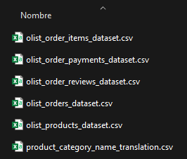

The team is not certain of which products are most valuable to their customers and believe they can optimize their inventory by better selecting their public offerings. Therefore, they need the following questions to be answered:

1. Which product categories have most of the sales?
2. Which categories have the highest shipping costs?
3. Which of these categories, considering only shipping costs, have the highest profit margin?
4. It is believed that products with better reviews have more sales. Is this really the case?
5. What is the preferred payment type by the customers and does it match with the payment type with the highest cash flow?

## **Analytical solution**
### **Summary**
The data provided accounts for the company's operations since September 2016 until October 2018. Over that period:

- **99,441** orders have been received.
- **112,650** different products have been dispatched.
- The company sold **R$ 13,591,643.70**.
- The company spent **R$ 2,251,909.54** on deliverying.
- Customers rated the service with **4.09** over 5.0 on average.
- Finally, a successful rate of **97.02%** delivered orders has been achieved.

In order to provide a quick and efficient answer to the questions of General Management, a series of barplot visualizations were obtained. Here are the results:

### **1. Which product categories have the most sales?**

To answer this question, an ***ABC Analysis*** (also known as ***Paretto Analysis***) was performed in order to classify the product categories into a large-sales, medium-sales and low-sales groups. This way, the large-sales group (named as ***A***) consists of those categories that account for ~80% of the sales volume. Groups B and C consist of categories that account for the other ~20%.

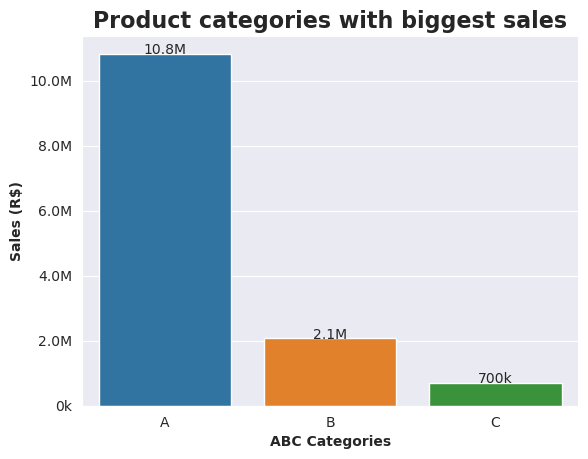

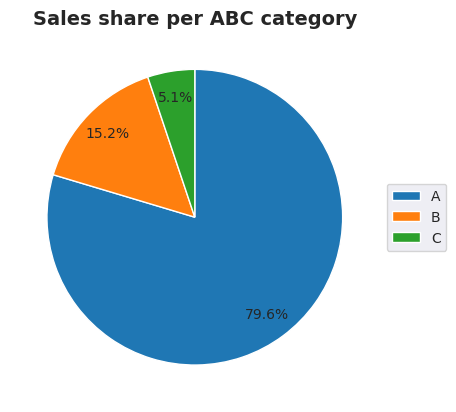

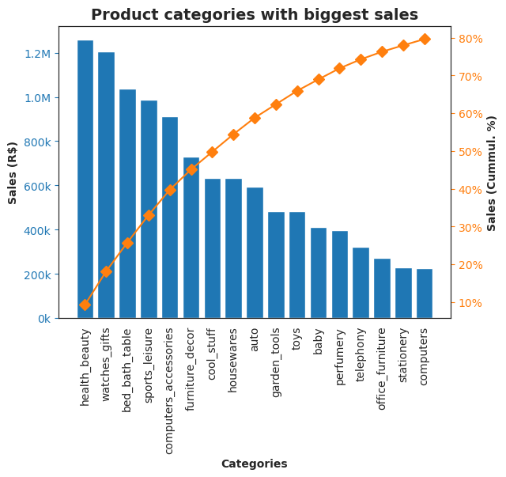

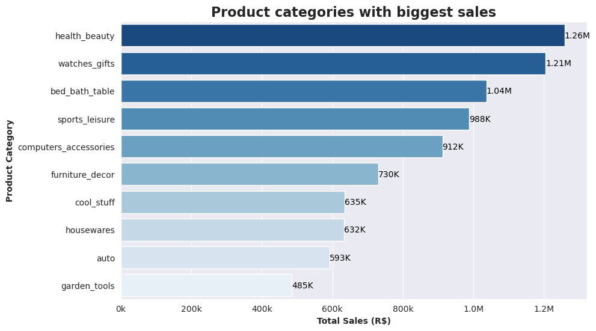

### **2. Which categories have the highest shipping costs?**

A similar analysis for this question as the one performed for the previous question was made, only this time the shipping costs were considered. Therefore, product categories on group A account for ~80% of the company's costs over the 2-year period data.

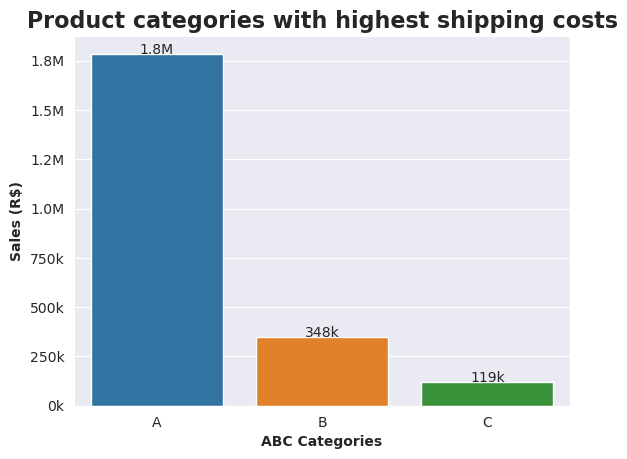

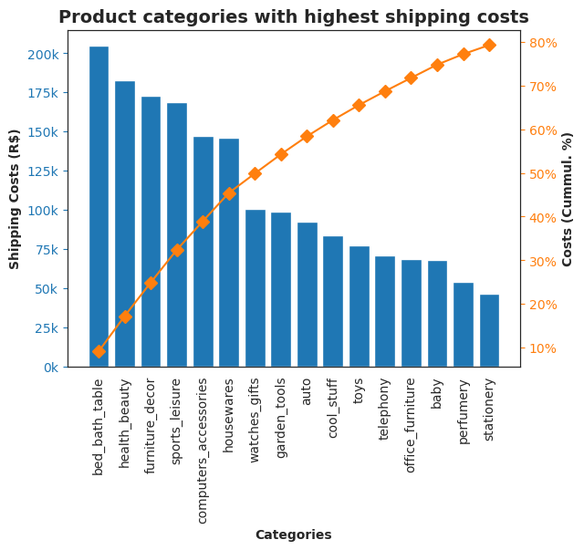

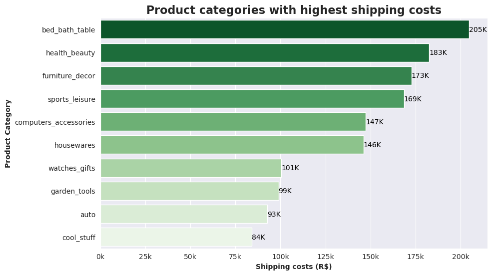

### **3. Which of these categories, taking only shipping costs into account, have the highest profit margin?**

For this project, the `Profit` was simply calculated as the difference between `Sales` and `Shipping Costs`. Therefore, the `Profit Margin (PM)` is the ratio between `Profit` and `Sales`.

$$ PM = {Sales - Costs \over Sales} * 100$$

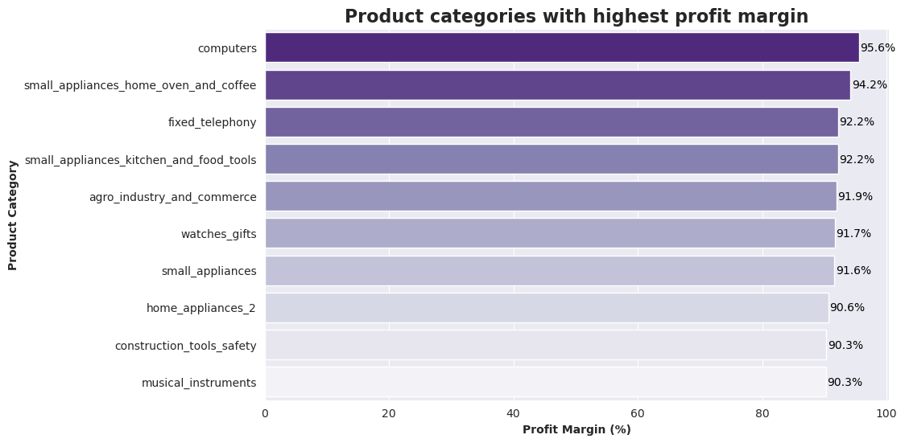

### **4. We believe that products with better reviews have more sales. Is this really the case?**

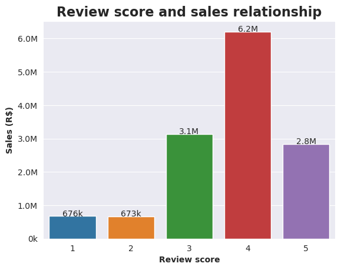

According to this barchart, products with the highest review score of 5.0 don't necessarily represent the largest sales volume. In fact, the largest sales are accounted by products rated as 4.0 (**R$ 6.2 Million**), followed by products rated 3.0 (**R$ 3.1 Million**). Products rated as 5.0 came in third place with a **R$ 2.8 Million** sales amount.

### **5. What is the preferred payment type for customers? And does it match with the payment type with the highest cash flow?**

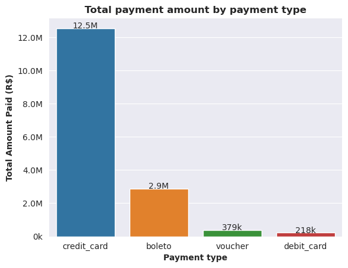

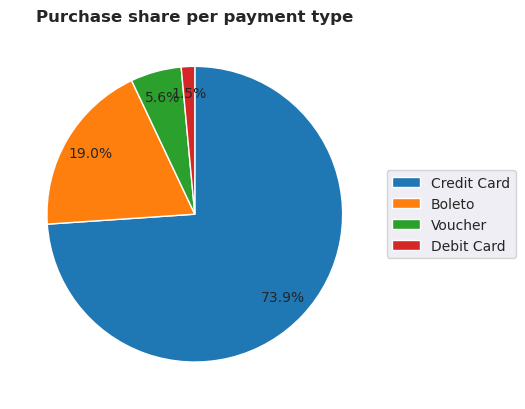

The largest amount of revenue (**R$ 12.5 Million**) comes from transactions executed by Credit Card. Therefore, customers prefer to use credit cards as their favourite payment method.

## **Technical solution**

### **Creation of the database**

After cleaning and preparing the data, in order to solve the case, the respective database was created using PostgreSQL to read and store the different CSV files, and design the respective data model as observed in the Entity-Relationship Diagram below. The file [benvindo_db.sql](/benvindo_db.sql) contains the SQL queries for the database creation.

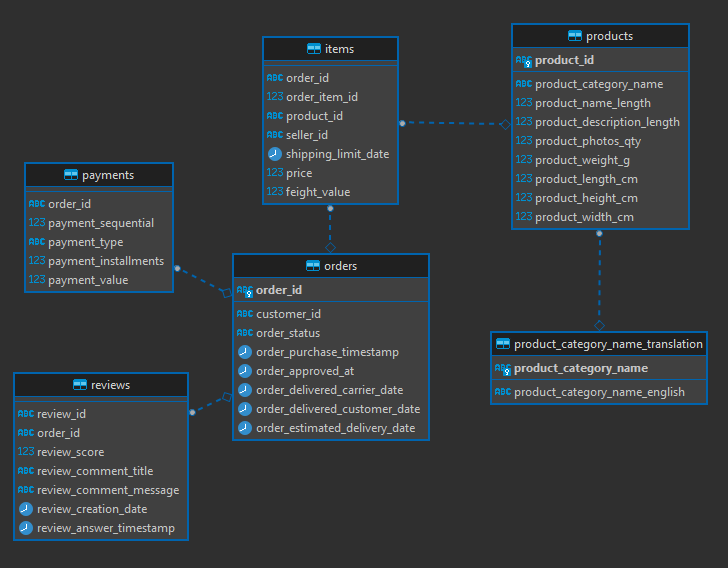

It's important to state that, the reason for solving the problem like this, is because of the significant amount of data contained in the CSV files. Normally, these types of insights would have been obtained in a much simpler way using Excel functions. However, by creating a data model with a RDBMS (Relational DataBase Management System) such as PostgreSQL (although there are several others), the data can be integrated and explored more efficiently and with reduced computational costs. 

Furthermore, the use of python libraries within a [notebook](/challenge_db.ipynb) makes it easier to connect to the database and to export replicable and scalable scripts if required.

### **Queries used**
The file [queries.sql](/queries.sql) contains the respective SQL queries used to answer each of the questions.